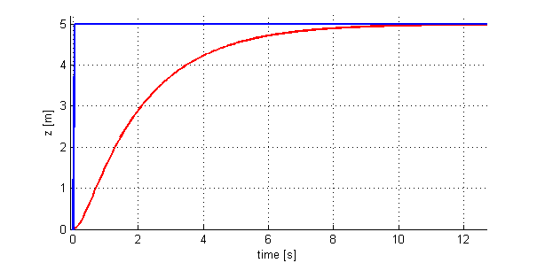

* 01_introduction-to-aerial-robotics
    * 01_1-1-introduction
        * 01_unmanned-aerial-vehicles.mp4
        * 02_quadrotors.mp4
        * 03_key-components-of-autonomous-flight.mp4
        * 04_state-estimation.mp4
        * 05_applications.mp4
        * 06_meet-the-tas.mp4

        - Reading: Setting up your Matlab programming environment
        - Reading: Matlab Tutorials - Introduction to the Matlab Environment
        - Reading: Matlab Tutorials - Programming Basics
        - Reading: Matlab Tutorials - Advanced Tools

    * 02_1-2-energetics-and-system-design
        * 01_basic-mechanics.mp4
            
            __1:16__ in-video quiz:
            Why don’t all the rotors of a quadrotor spin in the same direction?
            - [ ] Spinning all rotors in the same direction does not allow them to repel rain as efficiently.
            - [ ] Spinning all rotors in the same direction does not allow the quadrotor to fly upside down.
            - [ ] Spinning all rotors in the same direction will cause the robot to constantly rotate.

            __2:42__ in-video quiz:
            A quadrotor is at hover and the speeds of all its motors double, it will
            - [ ] Accelerate up
            - [ ] Accelerate down
            - [ ] Rotate clockwise when viewed from above
            - [ ] Rotate clockwise when viewed from below
            - [ ] Spinning all rotors in the same direction uses more battery power.
       
        * 02_dynamics-and-1-d-linear-control.mp4
            __1:07__ supplementary-material: _Dynamical Systems_
            `09_supplementary-material-dynamical-systems.mp4`
            __2:39__ supplementary-material: _Rates of Convergens_
            `10_supplementary-material-rates-of-convergence.mp4`

            You observe the response to a perturbation shown in the figure below:

            __5:49__ in-video quiz:
            What would you do to increase the speed of response?
            

            - [ ] Increase the integral gain (Ki)
            - [ ] Increase proportional gain (Kp)
            - [ ] Increase the derivative gain (Kv)
            - [ ] Decrease the proportional gain (p)

            __10:28__ Excercise: Gain tuning 
            `GainTuningExercise.zip`
            Download the simulation GUI attached below and unzip its content to the directory you wish to complete the exercise. Open MATLAB in that directory and type "runsim" in MATLAB Command Window to start the GUI. `GainTuningExercise.zip`
            Part 1: Tuning the proportional gain Kp
​	 

Given the derivative gain K_v = 18K 
v
​	 =18, find the proportional gain K_pK 
p
​	  value such that the rise time is less than 1s and overshoot is less than 5%.

Enter answer here

        * 03_design-considerations.mp4
            __3:37__ Excercise: Trust / Weight
            `ThrustWeightExercise.zip`
        * 04_design-considerations-continued.mp4
        * 05_agility-and-maneuverability.mp4
        * 06_component-selection.mp4
        * 07_effects-of-size.mp4
        * 08_supplementary-material-introduction.mp4
        * 09_supplementary-material-dynamical-systems.mp4
        * 10_supplementary-material-rates-of-convergence.mp4

* 02_geometry-and-mechanics
    * 01_2-1-quadrotor-kinematics
        * 01_transformations.mp4
        * 02_rotations.mp4
        * 03_euler-angles.mp4
        * 04_axis-angle-representations-for-rotations.mp4
        * 05_angular-velocity.mp4

    * 02_2-2-quadrotor-kinematics-supplementary-material
        * 01_supplementary-material-rigid-body-displacements.mp4
        * 02_supplementary-material-properties-of-functions.mp4
        * 03_supplementary-material-symbolic-calculations-in-matlab.mp4
        * 04_supplementary-material-the-atan2-function.mp4
        * 05_supplementary-material-eigenvalues-and-eigenvectors-of-matrices.mp4
        * 06_supplementary-material-quaternions.mp4
        * 07_supplementary-material-matrix-derivative.mp4
        * 08_supplementary-material-skew-symmetric-matrices-and-the-hat-operator.mp4    
    
    * 03_2-3-quadrotor-dynamics
        * 01_formulation.mp4
        * 02_newton-euler-equations.mp4
        * 03_principal-axes-and-principal-moments-of-inertia.mp4
        * 04_quadrotor-equations-of-motion.mp4
        * 06_supplementary-material-state-space-form.mp4
        * 07_supplementary-material-getting-started-with-the-first-programming-assignment.mp4

* 03_planning-and-control
* 04_advanced-topics
* 05_Resources