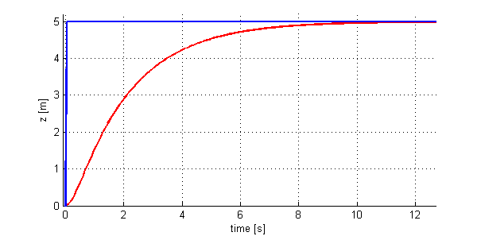
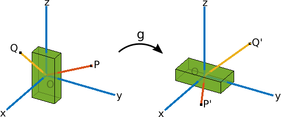

* 01_introduction-to-aerial-robotics
    * 01_1-1-introduction
        * 01_unmanned-aerial-vehicles.mp4
        * 02_quadrotors.mp4
        * 03_key-components-of-autonomous-flight.mp4
        * 04_state-estimation.mp4
        * 05_applications.mp4
        * 06_meet-the-tas.mp4

        - Reading: Setting up your Matlab programming environment
        - Reading: Matlab Tutorials - Introduction to the Matlab Environment
        - Reading: Matlab Tutorials - Programming Basics
        - Reading: Matlab Tutorials - Advanced Tools

    * 02_1-2-energetics-and-system-design
        * 01_basic-mechanics.mp4
            
            __1:16__ in-video quiz:
            Why don’t all the rotors of a quadrotor spin in the same direction?
            - [ ] Spinning all rotors in the same direction does not allow them to repel rain as efficiently.
            - [ ] Spinning all rotors in the same direction does not allow the quadrotor to fly upside down.
            - [ ] Spinning all rotors in the same direction will cause the robot to constantly rotate.

            __2:42__ in-video quiz:
            A quadrotor is at hover and the speeds of all its motors double, it will
            - [ ] Accelerate up
            - [ ] Accelerate down
            - [ ] Rotate clockwise when viewed from above
            - [ ] Rotate clockwise when viewed from below
            - [ ] Spinning all rotors in the same direction uses more battery power.
       
        * 02_dynamics-and-1-d-linear-control.mp4
            __1:07__ supplementary-material: _Dynamical Systems_
            `09_supplementary-material-dynamical-systems.mp4`
            __2:39__ supplementary-material: _Rates of Convergens_
            `10_supplementary-material-rates-of-convergence.mp4`

            You observe the response to a perturbation shown in the figure below:

            __5:49__ in-video quiz:
            What would you do to increase the speed of response?
            

            - [ ] Increase the integral gain (K<sub>i</sub>)
            - [ ] Increase proportional gain (K<sub>p</sub>)
            - [ ] Increase the derivative gain (K<sub>v</sub>)
            - [ ] Decrease the proportional gain (<sub>p</sub>)

            __10:28__ Excercise: Gain tuning 
            `GainTuningExercise.zip`
            Download the simulation GUI attached "below" and unzip its content to the directory you wish to complete the exercise. 
            Open MATLAB in that directory and type `runsim` in MATLAB Command Window to start the GUI. 
            
            __Part 1:__ Tuning the proportional gain K<sub>p</sub>
            Given the derivative gain K<sub>v</sub> = 18, find the proportional gain K<sub>p</sub> value such that the rise time is less than 1s and overshoot is less than 5%.
            Enter answer here [___]

            __Part 2:__ Tuning the derivative gain K<sub>v</sub>​	 
            Using the same simulation GUI from part 1, find the derivative gain K<sub>v</sub> such that the rise time is less than 1s and overshoot is less than 5% when the proportional gain K<sub>p</sub> is given as 100.
            Enter answer here [___]

        * 03_design-considerations.mp4
            __3:37__ Excercise: Trust / Weight
            Download the simulation GUI attached "below" and unzip its content to the directory you wish to complete the exercise.
            Open MATLAB in that directory and type runsim in MATLAB Command Window to start the GUI.
            `ThrustWeightExercise.zip`

            Given the maximum thrust of 11.77 N (1.2 Kgf) , what is the maximum mass (kg) such that the rise time is less than 1s? (Give an answer to 2 decimal places)
            Enter answer here [___]

        * 04_design-considerations-continued.mp4
        * 05_agility-and-maneuverability.mp4
        * 06_component-selection.mp4
        * 07_effects-of-size.mp4
        * 08_supplementary-material-introduction.mp4
        * 09_supplementary-material-dynamical-systems.mp4
        * 10_supplementary-material-rates-of-convergence.mp4

* 02_geometry-and-mechanics
    * 01_2-1-quadrotor-kinematics
        * 01_transformations.mp4
        __6:39__ in video Quiz
        Observe the inertial frame _x_, _y_, _z_ and the rigid body shown by the green cuboid in the left figure below. By applying a transformation _g_ to the rigid body, we obtain the rotated body as shown on the right.
            
        Due to the transformation _g_, points _P_ and _Q_ get transformed to _P'_ and _Q'_ respectively.  
        What is the correct expression for the position of point _P'_?
            - [ ] g(P)
            - [ ] g(Q)
            - [ ] g∗(P)
            - [ ] g∗(Q)  

        __6:39__ in vidoe quiz
        Given the same transformation as the previous question:
        
        Pick the correct expression(s) for the vector _(P' - Q')_?
        - [ ] _g∗(P)−g∗(Q)_
        - [ ] _g(P−Q)_
        - [ ] _g∗(P−Q)_
        - [ ] _g(P)−g(Q)_

        __9:16__ in video quiz
        Using the same transformation that we used before:  
        Recall that _x_, _y_ and _z_ are orthonormal.  
        Now, given that the vectors from the origin to the points _P_ and _Q_ are defined as __p__ = [0, 0.5, 0.25]<sup>T</sup> and __q__=[0.5,0,0.5]<sup>T</sup>, what is the value of the dot product __p__ ⋅ __q__? 
        (Please enter a numeric answer)
        Enter answer here [______]  

        __11:26__ in video quiz

        Recall the transformation that we've been using:  
        
        Which of the following rotation matrices best describes the transform _g_?
        - [ ]   ⎡ 0 1 0 ⎤
                ⎢ 0 0 1 |
                ⎣ 1 0 0 ⎦
        - [ ]   ⎡ 1 0 0 ⎤
                ⎢ 0 1 0 |
                ⎣ 0 0 1 ⎦
        - [ ]   ⎡ 0 0 1 ⎤
                ⎢ 1 0 0 |
                ⎣ 0 1 0 ⎦

        __12:15__ in video quiz
        Is the following matrix a rotation matrix?
        ```​math	  
            ⎡   0.9129  0.1695  0.3714 ⎤
        R = ⎢  −0.3651  0.7459  0.5571 |
            ⎣   0.1826  0.6442 −0.7428 ⎦
        ```
        - [ ] Yes
        - [ ] No

        __16:18__ supplementary-material: _rigid-body-displacements_  
        `01_supplementary-material-rigid-body-displacements.mp4`

        * 02_rotations.mp4
        __2:11__ in video quiz
        Is there a unique longitude and latitude for every point on the earth's surface?
        - [ ] Yes
        - [ ] No

        __3:11__ supplementary-material: _Function properties_  
        `02_supplementary-material-properties-of-functions.mp4`

        * 03_euler-angles.mp4
        * 04_axis-angle-representations-for-rotations.mp4
        __3:33__ supplementary-material: _Eigenvectors and Eigenvalues_  
        `05_supplementary-material-eigenvalues-and-eigenvectors-of-matrices.mp4`
        __7:38__ supplementary-material: _Skew-symetric matrices and the Hat operator_  
        `08_supplementary-material-skew-symmetric-matrices-and-the-hat-operator.mp4`


        * 05_angular-velocity.mp4

    * 02_2-2-quadrotor-kinematics-supplementary-material
        * 01_supplementary-material-rigid-body-displacements.mp4
        * 02_supplementary-material-properties-of-functions.mp4
        * 03_supplementary-material-symbolic-calculations-in-matlab.mp4
        * 04_supplementary-material-the-atan2-function.mp4
        * 05_supplementary-material-eigenvalues-and-eigenvectors-of-matrices.mp4
        * 06_supplementary-material-quaternions.mp4
        * 07_supplementary-material-matrix-derivative.mp4
        * 08_supplementary-material-skew-symmetric-matrices-and-the-hat-operator.mp4    
    
    * 03_2-3-quadrotor-dynamics
        * 01_formulation.mp4
        * 02_newton-euler-equations.mp4
        * 03_principal-axes-and-principal-moments-of-inertia.mp4
        * 04_quadrotor-equations-of-motion.mp4
        * 06_supplementary-material-state-space-form.mp4
        * 07_supplementary-material-getting-started-with-the-first-programming-assignment.mp4

* 03_planning-and-control
* 04_advanced-topics
* 05_Resources